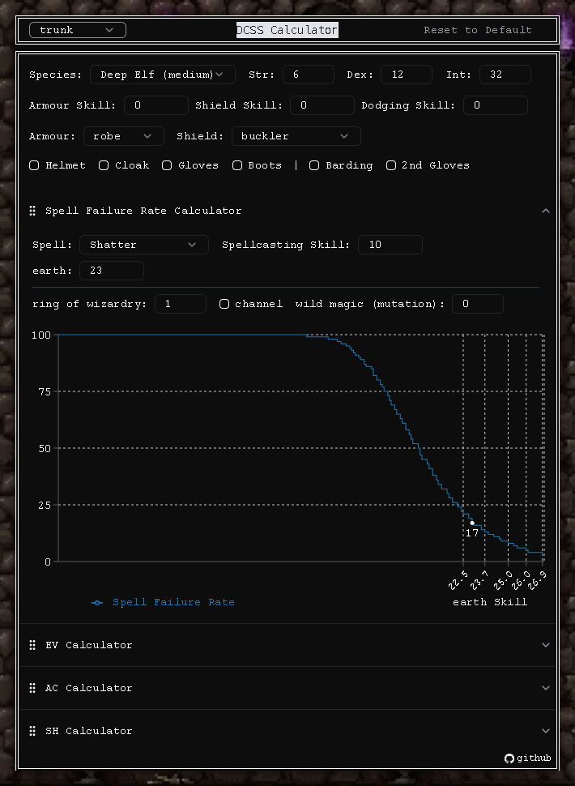

# DCSS Calculator ✖️➕➖➗ 🟰 ☠️

  

A tool that calculates and visually displays 'Spell Failure Rate', 'EV', 'AC', and 'SH' for Dungeon Crawl Stone Soup.

## How to Use

[Go to app ↗︎ (opens in new tab)](https://dcss-calculator.pages.dev/)

## Under Construction 🏗️

This tool is still under construction. Some features are not yet implemented, such as poltergeist auxiliary armours, etc. I'll be adding more features in the future... after I clear the dungeon with a Spriggan Fighter of Cheibriados in under 30k turns.
