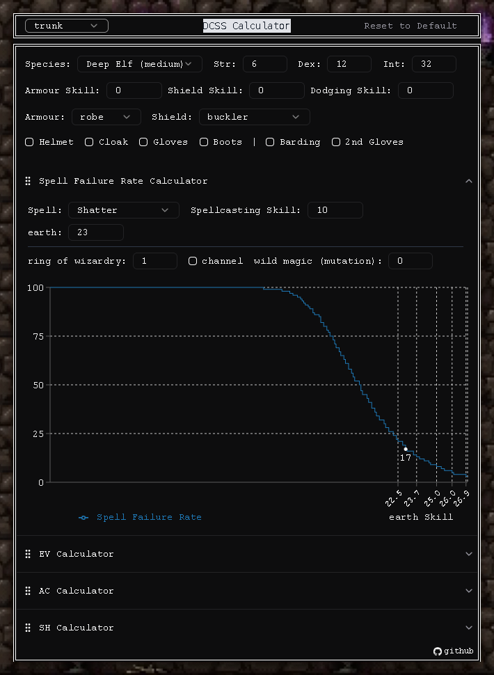

# DCSS Calculator ✖️➕➖➗ 🟰 ☠️

  

A tool that calculates and visually displays **Spell Failure Rate**, **EV**, **AC**, and **SH** for Dungeon Crawl Stone Soup.

And since most DCSS players are basically ancient dungeon-crawling fossils, I made the UI as outdated as they are.

## How to Use

This tool is run on web browser. [open app](https://dcss-calculator.pages.dev/)

## Maintenance

- [Versioning workflow](./docs/operations/versioning-workflow.md)
- [Crawl 0.34.1 to trunk audit](./docs/operations/crawl-0.34.1-to-trunk-audit.md)

## Supported Versions

- `0.32`
- `0.33`
- `0.34`
- `trunk`

## Under Construction 🏗️

This tool is still under construction. Some features are not yet implemented, such as poltergeist auxiliary armours, etc. I'll be adding more features in the future... after I clear the dungeon with a Spriggan Fighter of Cheibriados under 30k turns.
